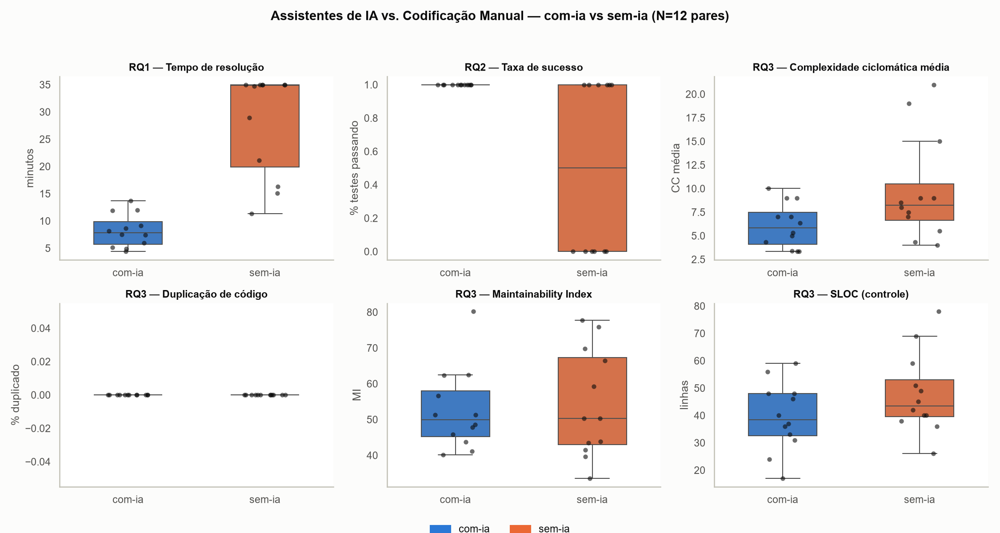

# Relatório Final — Assistentes de IA vs. Codificação Manual

**Laboratório de Experimentação de Software — PUC Minas, 2026/2**

Grupo: Arthur Pedra, Gabriel Sousa, Pedro Porto.
Repositório: <https://github.com/arthies2323/lab02-ia-vs-codificacao-manual>

---

## 1. Introdução

A adoção de assistentes de programação baseados em modelos de linguagem deixou
de ser experimental: ferramentas como GitHub Copilot, Cursor e Claude Code já
fazem parte do ambiente de trabalho cotidiano de equipes de desenvolvimento. A
promessa recorrente é de ganho de produtividade, mas a evidência empírica
disponível é majoritariamente anedótica ou baseada em autorrelato, e raramente
distingue *velocidade de digitação* de *velocidade de resolução do problema*.

Este trabalho investiga empiricamente esse efeito por meio de um experimento
controlado, em que os mesmos participantes resolvem as mesmas tarefas de
programação nas duas condições — com e sem assistente de IA — sob time-box e
com critério de conclusão objetivo (suíte de testes de aceitação passando).

### 1.1 Objetivo (GQM)

> **Analisar** o uso de assistentes de IA generativa na resolução de tarefas de
> programação,
> **com o propósito de** comparar seu efeito frente à codificação manual,
> **com respeito a** tempo de resolução, qualidade funcional (defeitos) e
> qualidade estrutural do código produzido,
> **do ponto de vista do** grupo pesquisador,
> **no contexto de** katas de dificuldade equivalente resolvidos por estudantes
> de graduação sob condições controladas (crossover within-subject, time-boxed).

### 1.2 Questões de pesquisa e hipóteses

**RQ1 — O uso de assistente de IA reduz o tempo de resolução da tarefa?**

- **H1₀:** não há diferença na mediana do tempo total de resolução entre trials
  com e sem assistente de IA.
- **H1₁:** o tempo total de resolução é menor nos trials com assistente de IA.

O tempo total compreende o ciclo completo de resolução — compreensão do
enunciado, projeto da solução, implementação e verificação — e não apenas a
fase de digitação de código. A operacionalização dessa definição é detalhada na
Seção 2.5.

**RQ2 — O uso de assistente de IA afeta a corretude da solução entregue dentro
do time-box?**

- **H2₀:** não há diferença na taxa de sucesso (percentual de testes de
  aceitação passando no encerramento do trial) entre os dois tratamentos.
- **H2₁:** a taxa de sucesso é maior nos trials com assistente de IA.

**RQ3 — O uso de assistente de IA afeta a qualidade estrutural do código
produzido?**

- **H3₀:** não há diferença na complexidade ciclomática média e/ou na duplicação
  de código (controladas por LOC) entre os dois tratamentos.
- **H3₁:** a complexidade ciclomática média e/ou a duplicação de código diferem
  entre os dois tratamentos.

A hipótese alternativa de RQ3 é **bicaudal**, diferentemente de RQ1 e RQ2. Não há
fundamento teórico para prever a direção do efeito: código gerado por assistente
pode ser mais regular e idiomático (reduzindo complexidade) ou mais verboso e
redundante (aumentando LOC e duplicação). Fixar uma direção *a priori* seria
arbitrário.

### 1.3 Organização do documento

A Seção 2 descreve a metodologia em detalhe suficiente para replicação,
incluindo as modificações feitas em relação ao desenho inicial e sua
justificativa. A Seção 3 apresenta os resultados por questão de pesquisa, a
Seção 4 discute as implicações e limitações, e a Seção 5 reúne os links do
repositório e do board do projeto.

---

## 2. Metodologia

### 2.1 Desenho experimental

O experimento é **crossover, within-subject e repetido**, com time-box de 35
minutos por trial.

- **Variável independente:** uso de assistente de IA durante o trial (binária:
  `com-ia` / `sem-ia`).
- **Unidade experimental:** um *trial*, definido como a resolução de um kata por
  um integrante sob um tratamento.
- **Sujeitos:** 3 integrantes do grupo, todos estudantes de graduação em
  Engenharia/Ciência da Computação.
- **Objetos:** 4 katas de programação em Python (Seção 2.2).
- **Total de medições:** 3 integrantes × 4 katas × 2 tratamentos = **24 trials**
  (12 por tratamento, 8 por integrante).

Cada integrante passa pelos dois tratamentos em **todos** os katas, de modo que
a comparação estatística é **pareada por (integrante, kata)**: o tempo com IA de
uma pessoa em um kata é comparado com o tempo sem IA da *mesma* pessoa no
*mesmo* kata. Isso controla simultaneamente a variação individual de habilidade
e a variação de dificuldade entre katas. A justificativa dessa escolha e sua
relação com o desenho originalmente previsto estão na Seção 2.7.

### 2.2 Objetos experimentais

Foram utilizados 4 katas em Python, com testes de aceitação em `pytest`:

| kata | tema | testes | SLOC (ref.) | CC total (ref.) |
|---|---|---|---|---|
| `fatura-progressiva` | faixas progressivas com bônus retroativo | 9 | 21 | 9 |
| `compactar-serie` | RLE com limiar de repetição e escape | 14 | 36 | 12 |
| `agenda-turnos` | intervalos circulares com folga mínima | 9 | 32 | 13 |
| `ranking-liga` | cascata de desempate com confronto direto | 9 | 48 | 18 |

**Equivalência de dificuldade.** Além de revisão cruzada pelo trio, a
equivalência foi ancorada objetivamente: uma solução de referência foi escrita
para cada kata e medida com o mesmo coletor usado na RQ3. As faixas obtidas
foram SLOC 21–48 (mediana 34), complexidade ciclomática total 9–18 e 9–14 testes
de aceitação. Registra-se que `ranking-liga` é o kata mais pesado (~2× o mais
leve), fato retomado na discussão de ameaças à validade.

**Mitigação de memorização pelo modelo.** A ameaça central a um experimento
deste tipo é o assistente reproduzir uma solução vista em treinamento, caso em
que o tratamento deixaria de medir assistência e passaria a medir recuperação de
memória. Os 4 katas partem de exercícios clássicos, mas foram adaptados segundo
uma regra fixa: **a alteração precisa invalidar a solução canônica**, não apenas
renomear variáveis ou trocar o domínio. Os mecanismos empregados foram inverter
o invariante do exercício-base, quebrar a estrutura de dados que a solução
canônica pressupõe, adicionar regra que contradiz o caso geral, mudar o escopo
do estado e exigir saída diagnóstica em vez do retorno original. Cada kata
documenta, na seção "Procedência e adaptação" do seu `README.md`, o
exercício-base, o que foi alterado e por que a solução canônica falha nos testes
de aceitação.

### 2.3 Tratamentos

**`com-ia`** — assistente habilitado durante todo o trial. O assistente é o
**Claude Code (Claude Opus 5)**, o mesmo em todos os trials do experimento.

A escolha do Claude Opus 5 foi deliberada e visa **fidelidade ao cenário
profissional atual**. O objetivo não é medir o efeito de um autocompletar de
linha, e sim o de um agente capaz de receber uma especificação e executar a
tarefa de ponta a ponta — que é o modo como essas ferramentas vêm sendo
efetivamente empregadas em equipes de desenvolvimento hoje. Medir um assistente
menos capaz responderia a uma pergunta já desatualizada no momento da
publicação.

**`sem-ia`** — codificação manual, sem qualquer assistente de IA: sem chat, sem
autocomplete por modelo de linguagem e sem geração de código. Consulta a
documentação oficial da linguagem e da biblioteca padrão é permitida, por ser
prática normal de desenvolvimento e não constituir assistência por IA.

### 2.4 Protocolo de execução de um trial

Este é o procedimento que deve ser seguido para replicar o experimento. Ele é
idêntico nos dois tratamentos até o passo 3, e é essa simetria que sustenta o
argumento de validade da Seção 2.8.

1. **Leitura do enunciado.** O participante lê o `README.md` do kata e os testes
   de aceitação. Os testes são visíveis e não podem ser editados em nenhum
   momento do trial.

2. **Confecção da spec (cronometrada).** O participante escreve um arquivo de
   especificação contendo: o design da solução, a abordagem escolhida, as
   funções a implementar com suas assinaturas, a decomposição em passos e os
   critérios de aceitação. Esse documento é o registro do **trabalho
   intelectual de projeto**, deliberadamente separado da implementação.

3. **Execução.** É aqui — e apenas aqui — que os tratamentos divergem:
   - **`com-ia`:** a spec do passo 2 é fornecida como entrada ao agente, que
     executa a implementação. Quando a spec é insuficiente, o agente solicita
     esclarecimento ou pair programming, e a interação é registrada.
   - **`sem-ia`:** o participante implementa manualmente a solução no seu slot.

4. **Verificação.** A suíte de aceitação é executada. O trial encerra quando
   todos os testes passam (*green*) ou quando o time-box de 35 minutos expira,
   o que ocorrer primeiro.

5. **Revisão do código.** O participante revisa a solução produzida. Esta etapa
   ocorre **após** a parada do cronômetro.

6. **Coleta.** Tempo e contagem de testes passando vão para `data/timings.csv`;
   as métricas estáticas do slot vão para `data/metrics.csv`.

**Ordem dos tratamentos.** Para cada kata, o trial **`com-ia` é executado
antes do `sem-ia`** — ordem fixada por todos os integrantes. A consequência
para a validade é a oposta da que se esperaria a princípio: ao revisar (passo
5) a solução produzida pelo agente antes de encarar o mesmo kata manualmente,
o participante já viu uma abordagem funcional para o problema, o que pode
tornar o trial `sem-ia` **artificialmente mais rápido ou mais bem-sucedido**
do que seria isoladamente — não o inverso. Essa é a mesma ameaça de efeito de
aprendizado residual já registrada na Seção 2.9; a consequência prática é que
ela tende a **subestimar**, não inflar, a vantagem observada do `com-ia` na
Seção 3 — um viés conservador em relação às hipóteses H1₁/H2₁.

**Isolamento entre tratamentos.** Cada tratamento é implementado em uma branch
distinta. Como o `com-ia` vem primeiro, o risco de indexação pelo assistente
(ele "ver" uma solução pronta e copiá-la em vez de gerá-la) não se aplica ao
próprio agente — não há solução manual anterior para indexar. O isolamento
por branch protege, em vez disso, o trial `sem-ia`: a solução já implementada
pelo agente para aquele kata não está presente na árvore de trabalho durante
o trial manual, então o participante não pode abrir ou copiar o arquivo
diretamente — apenas a memória de tê-la revisado (passo 5) permanece,
que é a ameaça discutida no ponto anterior e não elimina por completo.

**Encerramento por time-box.** Um trial que não atinge green em 35 minutos é
registrado com `tempo_min = 35.0000` e `censurado = true`, **não é descartado** e
entra na análise como observação censurada. A contagem de testes passando
registrada é a do instante do corte, não a do código final — se o participante
prosseguiu fora do time-box, esse trabalho posterior não é resultado do trial.

### 2.5 Variáveis dependentes e sua operacionalização

| RQ | Variável | Operacionalização |
|---|---|---|
| RQ1 | Tempo de resolução | Tempo total do ciclo de resolução, em minutos; censurado em 35 min. Agregação por **mediana**. |
| RQ2 | Defeitos | Taxa de sucesso = testes passando / testes totais do kata, no encerramento do trial. Complementarmente, o desfecho binário *atingiu green dentro do time-box*. |
| RQ3 | Estrutura do código | Complexidade ciclomática média e LOC/SLOC (Radon), percentual de duplicação (jscpd) e Maintainability Index como métrica composta. |

**Composição do tempo (RQ1).** O tempo de um trial compreende duas parcelas: a
confecção da spec (passo 2) e a implementação com verificação (passos 3 e 4).

No tratamento `sem-ia` ambas ocorrem dentro do trial cronometrado, e o valor
registrado pelo cronômetro já é o total. No tratamento `com-ia` a spec é
necessariamente escrita **antes** de o agente ser acionado — portanto antes de o
cronômetro iniciar. Essa etapa é cronometrada à parte pelo participante e somada
ao tempo do trial, de modo que o campo registrado represente o mesmo escopo nos
dois tratamentos.

Essa simetria é condição de validade da RQ1. Registrar no braço `com-ia` apenas
o tempo medido pelo cronômetro capturaria somente a latência do agente,
produzindo uma razão entre tratamentos que não descreve esforço humano algum. O
que a RQ1 compara é o **ciclo completo de resolução do problema** nas duas
condições.

**Justificativa das agregações.** Usa-se mediana em vez de média na RQ1 pelo N
pequeno e pela presença de observações censuradas, que tornam a média
enviesada e sensível a outliers. Na RQ2, taxa de sucesso normaliza katas com
números diferentes de testes (14 em `compactar-serie` contra 9 nos demais). Na
RQ3, as métricas estruturais são sempre lidas junto de LOC/SLOC como controle,
já que código gerado por assistente tende a ser mais verboso e uma queda de
complexidade *média* pode ser artefato de mais funções extraídas.

### 2.6 Instrumentação

Toda a coleta é automatizada e versionada no repositório, de modo a ser
auditável e reexecutável.

**Estrutura de slots.** Cada kata mantém 6 slots de solução independentes, um
por combinação integrante × tratamento:

```
katas/<kata>/
  README.md                            enunciado e procedência da adaptação
  TEMPOS.md                            registro legível dos tempos do kata
  test_<modulo>.py                     testes de aceitação (imutáveis)
  solucoes/<integrante>/<tratamento>/  slot de solução
```

O arquivo de teste é único para os 6 slots e não é duplicado: `katas/conftest.py`
publica no `sys.path` apenas o slot selecionado por `--integrante`/`--tratamento`
antes da coleta. Isso garante que os 24 trials sejam avaliados exatamente pelos
mesmos critérios de aceitação.

**Cronometragem** (`scripts/timer.py`). Inicia junto com o trial, executa a
suíte do kata a cada 5 segundos e encerra no green ou no time-box, gravando o
resultado em `data/timings.csv`. A cada ciclo registra a contagem de testes
passando, de forma que um trial censurado preserve o estado da suíte no instante
do corte — dado da RQ2 que, de outra forma, não existiria.

**Métricas estáticas** (`scripts/collect_static_metrics.py`). Executa Radon
(`raw`, `cc`, `mi`) e jscpd 5.2.0 sobre o slot do trial, acrescentando uma linha
a `data/metrics.csv`.

### 2.7 Ambiente e reprodução

```bash
python -m pip install -r scripts/requirements.txt   # Python 3.10+
npm install                                          # jscpd 5.2.0 (fixado)
python scripts/check_environment.py                  # diagnóstico do ambiente
```

Execução de um trial:

```bash
python scripts/timer.py --kata <kata> --tratamento <com-ia|sem-ia> \
    --integrante <nome>
```

Coleta das métricas estáticas do trial:

```bash
python scripts/collect_static_metrics.py \
    --path katas/<kata>/solucoes/<integrante>/<tratamento> \
    --kata <kata> --integrante <nome> --tratamento <com-ia|sem-ia> \
    --out data/metrics.csv
```

Verificação da infraestrutura de coleta:

```bash
python -m pytest tests -q
```

### 2.8 Modificações em relação ao desenho inicial

Duas alterações foram feitas durante a preparação (Sprint 1 → Sprint 2) e são
registradas aqui com sua justificativa.

#### 2.8.1 Redução de 6 para 4 katas

O desenho inicial previa 6 katas. A redução para 4 viabiliza o desenho repetido
descrito a seguir sem inviabilizar o tempo de execução da Sprint 2: com 6 katas,
o desenho repetido exigiria 36 trials e até 21 horas de execução cronometrada
para o trio. Os 4 katas mantidos preservam a faixa de dificuldade validada
objetivamente e o número par necessário à divisão entre tratamentos.

#### 2.8.2 Do desenho contrabalanceado para o desenho repetido

**O que mudou.** No desenho originalmente especificado, cada integrante
resolveria cada kata **uma única vez**, sob um único tratamento, com a atribuição
combinada entre os três de modo que cada kata aparecesse nos dois tratamentos ao
longo do trio. O desenho adotado faz cada integrante resolver **todos os katas
nos dois tratamentos**.

**Por que a mudança aumenta a fidelidade dos dados.** O desenho contrabalanceado
pressupõe que katas de dificuldade *classificada* como equivalente custem tempos
comparáveis. Essa premissa não se sustentou. A validação objetiva já indicava
dispersão relevante — SLOC de 21 a 48, complexidade ciclomática total de 9 a 18,
com `ranking-liga` pesando cerca de 2× o mais leve — e a natureza do desafio
introduz variação que nenhuma métrica estática captura: um kata pode exigir a
descoberta de um invariante não óbvio, e essa descoberta ou acontece em cinco
minutos ou consome o time-box inteiro, praticamente sem valores intermediários.

No desenho contrabalanceado, essa variação entra diretamente no contraste entre
tratamentos: se o kata `ranking-liga` cai no braço `sem-ia` e o
`fatura-progressiva` no braço `com-ia`, parte da diferença medida é diferença
**entre katas**, não entre tratamentos — e não há como separar as duas com N
pequeno. O efeito é um viés, não apenas ruído, e sua direção depende do sorteio.

No desenho repetido, cada kata aparece nos **dois lados de cada par**. A
dificuldade intrínseca do kata passa a ser uma constante dentro do par e é
eliminada por construção na comparação pareada. Ganha-se ainda o dobro do N por
integrante (8 trials em vez de 4), o que importa em um experimento com apenas 3
sujeitos.

#### 2.8.3 Por que o desenho repetido não compromete a validade

A objeção evidente ao desenho repetido é o **efeito de aprendizado**: se a mesma
pessoa resolve o mesmo kata duas vezes, a segunda passagem tende a ser mais
rápida por já conhecer o problema, e não pelo tratamento. Essa objeção é
legítima e foi o motivo de o desenho contrabalanceado ter sido a escolha
inicial. O protocolo de execução da Seção 2.4 foi construído especificamente
para neutralizá-la, e o argumento tem três partes.

**Primeiro, o trabalho de compreensão e projeto é feito uma única vez e cobrado
das duas condições.** A spec é o artefato que materializa a parte da tarefa em
que o aprendizado de fato ocorre: entender o enunciado, identificar o invariante
do problema e decidir a decomposição em funções. Ela é escrita uma vez por
(integrante, kata) e seu tempo é contabilizado nos **dois** tratamentos — dentro
do trial manual, e somado explicitamente ao tempo do trial com IA. O
segundo trial, portanto, não "ganha de graça" a etapa de compreensão: ela está
precificada nos dois lados do par. O que resta variando entre os tratamentos é
exclusivamente a fase de implementação, que é justamente o objeto da
intervenção.

**Segundo, a spec é congelada antes de qualquer execução, e alimenta os dois
tratamentos sem alteração.** O passo de confecção da spec (2) precede o passo
de execução (3) nos dois casos — ela é escrita uma única vez, antes de o
agente ou o participante começarem a implementar. Por isso nenhum tratamento
retroalimenta o outro através da spec: o que se aprende implementando
manualmente não chega ao agente por essa via, e nada no processo do agente
poderia ter influenciado a spec que o participante recebe, porque essa spec já
estava fechada antes de ambas as execuções existirem. A spec funciona como um
ponto de controle comum, fixado antes de qualquer aprendizado específico de
implementação.

**Terceiro, a ordem executada (`com-ia` → `sem-ia`) protege o agente, e a
separação por branches limita — sem eliminar — a exposição do braço manual.**
Como o `com-ia` é executado primeiro, não existe solução manual anterior para
o agente indexar naquele kata: o risco de o agente "ver" uma implementação
humana pronta e devolvê-la como produção própria simplesmente não se aplica,
nesta ordem. O risco simétrico corre na outra direção — ao revisar (passo 5) a
solução do agente antes de encarar o mesmo kata manualmente, o participante já
viu uma implementação funcional daquele problema. A separação por branches
impede que essa exposição vá além da memória do participante: durante o trial
`sem-ia`, o arquivo da solução `com-ia` não está na árvore de trabalho, então
não pode ser aberto ou copiado diretamente — só a lembrança de já ter visto uma
abordagem funcionar permanece, e essa lembrança **não é eliminada** pelo
isolamento de arquivos. A garantia de isolamento é dada pelo versionamento, não
pela disciplina de quais arquivos permanecem abertos no editor.

**Limite honesto do argumento.** As três medidas reduzem substancialmente o
efeito, mas não o eliminam. Um participante que já revisou a solução do agente
retém alguma familiaridade com o problema ao encarar o mesmo kata manualmente
depois, ainda que o projeto em si esteja registrado e congelado na spec desde
antes de qualquer execução. O grupo trata essa parcela residual como **ameaça
aceita e declarada**, não como ameaça eliminada, e a leitura dos resultados da
RQ1 (Seção 3) é feita sob essa ressalva — notando que essa ordem tende a
**favorecer** o `sem-ia`, então a vantagem observada do `com-ia` é, se algo,
subestimada por este viés, não inflada. A alternativa — o desenho
contrabalanceado — não era neutra: trocaria um viés residual e conhecido por
um viés de dificuldade entre katas de magnitude desconhecida e direção
dependente de sorteio.

### 2.9 Demais ameaças à validade

| Ameaça | Mitigação adotada |
|---|---|
| Memorização do kata pelo modelo | Adaptações que invalidam a solução canônica (Seção 2.2) |
| Contaminação entre integrantes via indexação do workspace | Branch por integrante a partir da tag `katas-v1`; nenhum `pull` da branch de outro antes de concluir os próprios trials |
| Vazamento entre tratamentos do mesmo participante (agente→manual, já que `com-ia` executa primeiro) | Branch separada por tratamento: no trial `sem-ia` a solução `com-ia` do kata não está na árvore de trabalho; resíduo de memória tratado como ameaça aceita (Seção 2.8.3) |
| Variação individual de habilidade | Desenho within-subject: cada integrante é comparado consigo mesmo |
| Dificuldade não idêntica entre katas | Eliminada dentro do par pelo desenho repetido (Seção 2.8.2) |
| Familiaridade prévia com o assistente | Registrada por integrante e reportada na Seção 4 |
| Edição dos critérios de aceitação | Testes imutáveis durante o trial; violação detectável no histórico do Git |

### 2.10 Análise estatística

As tabelas descritivas reportam mediana e intervalo interquartil por tratamento.
A análise inferencial usa o **teste de Wilcoxon pareado** (não paramétrico),
pareando por (integrante, kata) — 12 pares —, escolha condizente com N pequeno,
ausência de normalidade assumida e desenho within-subject. Observações
censuradas são mantidas na análise e sinalizadas; a RQ1 é reportada
adicionalmente sob a forma binária *atingiu green dentro do time-box*, que é
definida para todos os trials independentemente do censuramento.

---

## 3. Resultados

Gerados por [`scripts/analyze_results.py`](../scripts/analyze_results.py) sobre
`data/timings.csv` e `data/metrics.csv`. **N = 12 pares (integrante, kata)** —
os 3 integrantes completos, 4 katas cada, conforme o desenho (Seção 2.1).

**Dashboard (Passo 6).** Gerado por
[`scripts/build_dashboard.py`](../scripts/build_dashboard.py) — boxplot com
pontos individuais, `com-ia` vs `sem-ia`, para as seis métricas abaixo. As
figuras individuais estão em `Relatorios/graficos/`.



### 3.1 RQ1 — Tempo de resolução

| tratamento | mediana (min) | IQR |
|---|---|---|
| com-ia | 7.85 | [5.75, 9.86] |
| sem-ia | 34.88 | [19.89, 35.00] |

Wilcoxon pareado: estatística = 0.0, **p = 0.0005** — diferença estatisticamente
significativa, com `com-ia` menor. Sem outliers pela regra do IQR (1.5×) em
nenhum dos dois tratamentos.

### 3.2 RQ2 — Defeitos (taxa de sucesso)

| tratamento | mediana | IQR |
|---|---|---|
| com-ia | 1.00 | [1.00, 1.00] |
| sem-ia | 0.50 | [0.00, 1.00] |

Wilcoxon pareado: estatística = 0.0, **p = 0.0312** — diferença estatisticamente
significativa, com `com-ia` maior. Dos 12 pares, 6 têm diferença zero
(`com-ia` e `sem-ia` ambos com taxa 1.0) e são descartados pelo método padrão
do teste (`zero_method="wilcox"`); dos 6 pares restantes, **os 6** favorecem
`com-ia` (sem-ia = 0, censurado sem nenhum teste passando). Com N efetivo de
6 pares informativos, todos na mesma direção, o teste exato atinge
significância a 5% (p = 2×0,5⁶ = 0,03125).

### 3.3 RQ3 — Estrutura do código

| métrica | com-ia (mediana, IQR) | sem-ia (mediana, IQR) | Wilcoxon (estat., p) |
|---|---|---|---|
| Complexidade ciclomática média | 5.83 [4.10, 7.50] | 8.25 [6.63, 10.50] | 3.5, **p=0.0117** |
| Duplicação (%) | 0.0 [0.0, 0.0] | 0.0 [0.0, 0.0] | sem variação — teste não aplicável |
| Maintainability Index | 49.92 [45.27, 58.04] | 50.36 [42.98, 67.31] | 36.0, p=0.8501 |
| SLOC (controle) | 38.50 [32.50, 48.00] | 43.50 [39.50, 53.00] | 4.0, **p=0.0137** |

Com os 12 pares, a complexidade ciclomática média e o SLOC de controle
atingem significância a 5%, ambos com `com-ia` menor — incluindo o
controle, o resultado não é artefato de o código `com-ia` só *parecer* mais
simples por ser mais verboso (Seção 2.5); ele é, nesta amostra,
simultaneamente mais curto e menos complexo. O Maintainability Index (métrica
composta) não acompanha essa direção e fica sem diferença significativa —
esperado, já que ele também soma o volume de Halstead, que não colapsa na
mesma direção de SLOC/CC nesta amostra. Dois outliers foram identificados
pela regra do IQR, ambos em `ranking-liga` `sem-ia` — `arthur` (CC média
19.0) e `gabriel` (CC média 21.0) — o kata mais pesado do conjunto
(Seção 2.2); mantidos na análise por serem observações legítimas, não erro
de coleta. Um terceiro outlier aparece no MI: `pedro/fatura-progressiva`
`com-ia` (MI 80.18).

Duplicação ficou em 0% nos dois tratamentos em todos os pares — resultado
esperado, não uma medição nula: o jscpd exige um bloco mínimo de ~50 tokens
para reconhecer uma duplicata, e as soluções dos katas são pequenas demais
para atingir esse limiar mesmo quando há repetição de lógica.

### 3.4 RQ1 (exploratória) — número de prompts/interações

Métrica opcional, citada no enunciado como exploratória, não obrigatória.
**Autorrelato dos três integrantes, não instrumentado**: nenhum log de
prompt é gerado ou versionado pelo protocolo (Seção 2.6), então este número
não tem o mesmo nível de evidência que os dados de `timings.csv`/`metrics.csv`.

Segundo relato dos três integrantes, cada um resolveu cada um dos 4 katas do
tratamento `com-ia` com **1 único prompt** — a spec produzida no passo 2 do
protocolo (Seção 2.4) foi suficiente para o agente entregar a solução
completa e correta na primeira submissão, sem rodada de correção. Isso é
consistente com a taxa de sucesso de 100% observada em todos os pares
`com-ia` na Seção 3.2, e sugere que, para katas deste porte (SLOC 21–48,
Seção 2.2), o ponto de atrito do tratamento manual não é apenas a digitação,
mas a fase de projeto da solução — que a spec, no tratamento `com-ia`,
resolve antes mesmo de o agente ser acionado.

## 4. Discussão

### 4.1 Síntese por RQ

**RQ1 (tempo) e RQ2 (defeitos) — resultado convergente e significativo.** O
`com-ia` foi mais rápido (mediana 7,85 min vs. 34,88 min) e mais bem-sucedido
(taxa de sucesso 1,00 vs. 0,50) que o `sem-ia`, com significância estatística
nos dois casos (RQ1: p=0,0005; RQ2: p=0,0312 — Seções 3.1 e 3.2). Os dois
efeitos apontam para a mesma direção e reforçam-se mutuamente: parte da
vantagem de tempo não é apenas "digitar mais rápido" — é que seis dos doze
trials `sem-ia` nunca chegaram a *green* dentro do time-box, e nenhum
`com-ia` deixou de chegar. A métrica exploratória de RQ1 (Seção 3.4) — um
único prompt por kata, suficiente para a solução completa — é consistente com
essa leitura: para katas deste porte, a spec produzida no passo 2 do
protocolo (Seção 2.4) parece capturar o essencial do problema, e a
implementação em si é o que a IA resolve de forma confiável.

**RQ3 (estrutura do código) — significativo em complexidade e no controle,
não no índice composto.** A complexidade ciclomática média do `com-ia` foi
menor (5,83 vs. 8,25; p=0,0117) e, criticamente, o **controle de LOC também
foi menor** (SLOC 38,5 vs. 43,5; p=0,0137) — o código com IA não é apenas
"aparentemente mais simples por ser mais verboso"; nesta amostra ele é
simultaneamente **mais curto e menos complexo**, o oposto do que a
verbosidade atribuída a assistentes de IA levaria a esperar. O Maintainability
Index não acompanha essa direção (p=0,85) — por ser uma métrica composta que
soma volume de Halstead, LOC e complexidade, o ganho em duas dessas
componentes não necessariamente se propaga a ela nesta amostra pequena. A
duplicação de código ficou em 0% nos dois tratamentos, em todos os 24 trials
— isso não corrobora nem refuta H3, porque é um piso instrumental do jscpd
(bloco mínimo de ~50 tokens, Seção 3.3), não uma medição de fato ausente de
repetição de lógica.

### 4.2 Leitura sob a ressalva do efeito de aprendizado residual

A ordem executada (`com-ia` → `sem-ia`, Seção 2.4) tem uma consequência que
precisa ser explícita aqui: ela tende a **favorecer o `sem-ia`**, não o
`com-ia`. Ao revisar a solução do agente antes de implementar o mesmo kata à
mão, cada participante já tinha visto uma abordagem funcional para o
problema — uma vantagem que a condição manual não deveria ter, por definição
(Seção 2.8.3). Isso significa que a vantagem do `com-ia` observada em RQ1 e
RQ2 é, se algo, **subestimada** pelo desenho, não inflada: o `sem-ia` teve
uma ajuda residual que o `com-ia` não teve, e mesmo assim ficou
significativamente atrás. Essa é uma leitura mais forte para H1₁/H2₁ do que
se a ressalva não existisse.

**Familiaridade prévia com o assistente.** Os três integrantes já tinham
usado Claude/Claude Code antes do experimento, em grau variado, mas nenhum
pela primeira vez neste trabalho. Não há, portanto, um participante
"iniciante absoluto" cujos trials `com-ia` estivessem sujeitos a uma curva de
aprendizado da própria ferramenta — o grupo trata esse fator como
relativamente controlado entre integrantes, embora não tenha sido medido em
escala (limitação registrada em 4.3).

### 4.3 Limitações

- **N pequeno.** Doze pares é suficiente para os testes de Wilcoxon
  reportarem significância em quatro das seis comparações, mas não sustenta
  generalização além deste grupo e destes katas. Em RQ2 especificamente, seis
  dos doze pares têm diferença zero e são descartados pelo teste
  (Seção 3.2) — o N *efetivo* ali é a metade do nominal.
- **Um único assistente, uma única versão.** A escolha do Claude Code
  (Claude Opus 5, Seção 2.3) foi deliberada, mas os resultados não devem ser
  generalizados para outros assistentes ou versões sem novas medições.
- **Duplicação de código não observável nesta escala.** O piso de ~50 tokens
  do jscpd (Seção 3.3) impede que RQ3 diga algo sobre duplicação em katas
  deste tamanho; katas maiores, ou uma ferramenta com limiar configurável
  mais baixo, seriam necessários para essa parte específica de H3.
- **Familiaridade prévia não medida em escala.** Registrada qualitativamente
  (4.2), não quantitativamente — não é possível separar estatisticamente o
  efeito do tratamento do efeito de habilidade prévia com a ferramenta.
- **Dificuldade dos katas.** `ranking-liga` é sistematicamente o kata mais
  pesado (Seção 2.2) e concentra os outliers de RQ3 (Seção 3.3). O desenho
  repetido neutraliza isso na comparação pareada, mas o dado bruto por kata
  não deve ser lido fora desse contexto.

### 4.4 Resposta às hipóteses

| RQ | H0 | Decisão | Wilcoxon | N (pares) |
|---|---|---|---|---|
| RQ1 | Sem diferença de mediana no tempo | **Rejeitada** — `com-ia` menor (34,88 → 7,85 min) | W=0,0; p=0,0005 | 12 |
| RQ2 | Sem diferença na taxa de sucesso | **Rejeitada** — `com-ia` maior (0,50 → 1,00) | W=0,0; p=0,0312 | 12 (6 efetivos) |
| RQ3 — complexidade | Sem diferença na CC média | **Rejeitada** — `com-ia` menor (8,25 → 5,83) | W=3,5; p=0,0117 | 12 |
| RQ3 — duplicação | Sem diferença na duplicação | **Não rejeitada** — sem evidência, não sem efeito (piso do jscpd, Seção 3.3) | teste não aplicável (0% nos dois lados) | 12 |

Em RQ1 e RQ2 a rejeição de H0 é conservadora, não inflada — a ordem executada
favorece o `sem-ia` (Seção 4.2). Em RQ3, a queda de complexidade veio junto
com a queda no SLOC de controle: o código `com-ia` não é só mais curto, é
também menos complexo. Duplicação fica indeterminada, não refutada — ninguém
dos 24 trials teve bloco grande o bastante pro jscpd contar.

## 5. Repositório e board

- **Repositório:** <https://github.com/arthies2323/lab02-ia-vs-codificacao-manual>
- **GitHub Projects (board):** <https://github.com/users/arthies2323/projects/2>

O board contém as 15 issues do experimento (Sprints 1–3), cada uma com o(s)
commit(s)/PR(s) correspondente(s) linkado(s) e o campo *Assignee* preenchido
por integrante responsável, conforme exigido pelo enunciado.
